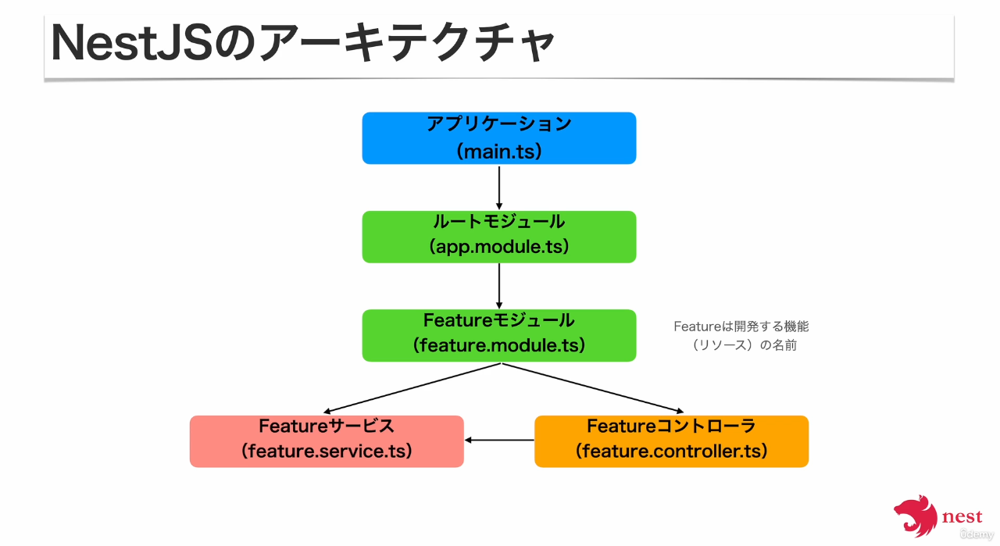
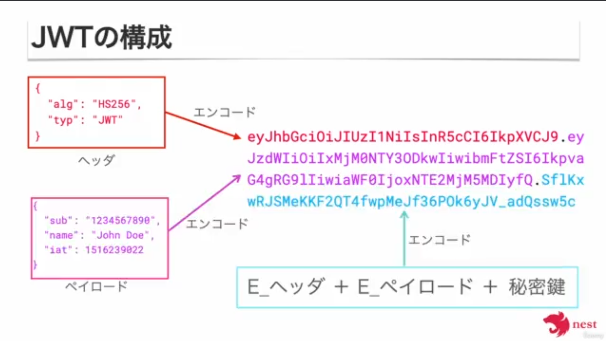
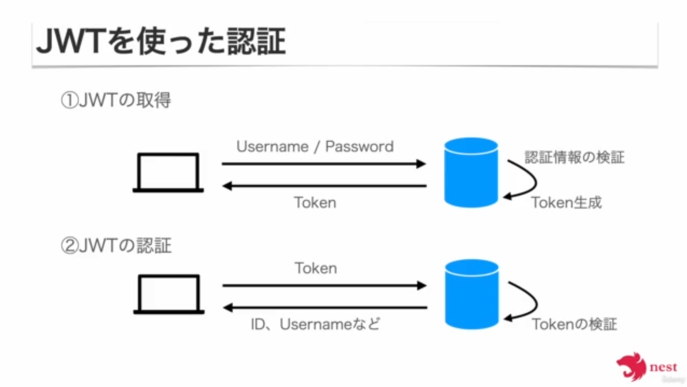

<p align="center">
  <a href="http://nestjs.com/" target="blank"></a>
</p>

[circleci-image]: https://img.shields.io/circleci/build/github/nestjs/nest/master?token=abc123def456
[circleci-url]: https://circleci.com/gh/nestjs/nest

  <p align="center">A progressive <a href="http://nodejs.org" target="_blank">Node.js</a> framework for building efficient and scalable server-side applications.</p>
    <p align="center">
<a href="https://www.npmjs.com/~nestjscore" target="_blank"></a>
<a href="https://www.npmjs.com/~nestjscore" target="_blank"></a>
<a href="https://www.npmjs.com/~nestjscore" target="_blank"></a>
<a href="https://circleci.com/gh/nestjs/nest" target="_blank"></a>
<a href="https://coveralls.io/github/nestjs/nest?branch=master" target="_blank"></a>
<a href="https://discord.gg/G7Qnnhy" target="_blank"></a>
<a href="https://opencollective.com/nest#backer" target="_blank"></a>
<a href="https://opencollective.com/nest#sponsor" target="_blank"></a>
  <a href="https://paypal.me/kamilmysliwiec" target="_blank"></a>
    <a href="https://opencollective.com/nest#sponsor"  target="_blank"></a>
  <a href="https://twitter.com/nestframework" target="_blank"></a>
</p>
  <!--[](https://opencollective.com/nest#backer)
  [](https://opencollective.com/nest#sponsor)-->

## Description

[Nest](https://github.com/nestjs/nest) framework TypeScript starter repository.

## Installation

```bash
$ npm install
```

## Running the app

```bash
# development
$ npm run start

# watch mode
$ npm run start:dev

# production mode
$ npm run start:prod
```

## Test

```bash
# unit tests
$ npm run test

# e2e tests
$ npm run test:e2e

# test coverage
$ npm run test:cov
```

## Support

Nest is an MIT-licensed open source project. It can grow thanks to the sponsors and support by the amazing backers. If you'd like to join them, please [read more here](https://docs.nestjs.com/support).

## Stay in touch

- Author - [Kamil Myśliwiec](https://kamilmysliwiec.com)
- Website - [https://nestjs.com](https://nestjs.com/)
- Twitter - [@nestframework](https://twitter.com/nestframework)

## License

Nest is [MIT licensed](LICENSE).

## NestJSの基本アーキテクチャ



## Controllerについて

Controllerがルーティングの機能を担う

1. classに@Controller()デコレーターを付ける

```typescript
import { Controller } from '@nestjs/common';

@Controller('User')
export class UsersController {}
```

2. メソッド(ハンドラー)にHTTPメソッドデコレーターを付ける

```typescript
@Controller('users)
export class UsersController {
  @Post()
  create() {
    // Create User
  }
}
```

## Serviceについて

- ビジネスロジックを定義する
- Controllerから呼び出すことで、ユースケースを実現する
- Controllerにビジネスロジックを書いてもプログラムは動作するが、Controllerの責務はルーティングなので。
  - 責務毎に分割することで、保守性・拡張性等上がり良い設計となる
- 定義
  1. classに`@Injecable()`でデコレーターを付ける ※`@Service()`ではない

  ```typescript
  Import { Injectable } from '@nestjs/common';
  
  @Injectable()
  export class UserService {}
  ```

  2. ビジネスロジックを実現するメソッドを作成する

   ```typescript
  @Injectable()
    export class UserService {
      find(userName: string) {
        // Find user
      }
    }
   ```

  3. ModuleのprovidersにServiceを登録する

  ```typescript
  @Module({
    controllers: [UserController],
    providers: [UserService],
  })
  export class UsersModule {}
  ```

  4. ControllerのconstructorでServiceを引数にとる

  ```typescript
  @Controller('users')
  export class UsersController {
    constructor(private readonly UserService: UserService) {}
  
    @Get(':username')
    find(@Param('username') userName: string) {
      this.userService.find(userName);
    }
  }
  ```
- Nest Cliで作成する

```bash
nest g service items --no-spec # --no-specオプション付けると関連するスクリプト(テストとか)が生成されない
```

## Dependency Injection (DI)

- 依存関係のあるオブジェクトを外部から渡す
- 依存元のプログラムを書き換えることなく、依存先を変更できる
  - 主な用途
    - 本番用とテスト用でインスタンスの切り替え
    - ログの出力先の切り替え

## DTOについて
- データの受け渡しに使われるオブジェクト
  - データベースとモデルクラス間のデータのやり取り
  - リクエストオブジェクトからのデータ受け取り
- メンテナンス性が高まる
  - データの内容や型等が変更になった場合でも、修正箇所をDTO内に閉じ込めることができる
- 安全性が高まる
  - やりとりするデータをDTOの型に制限することができるので、誤ったデータが扱われるリスクが減る
- NestJSのバリデーション機能が使える
  - 型チェックだけではなく複雑なバリデーションも可能

## NestJSでバリデーションを行う方法
- Pipeという機能を使う
  - ハンドラーがリクエストを受け取る前にリクエストに対して処理を行う
  - データの変換とバリデーションが可能
  - 処理を行った後のデータをハンドラーに渡す
  - Pipeの処理中に例外を返すことも可能
  - NestJSの組み込みPipe
    - ValidationPipe   : 入力のバリデーション
    - ParseIntPipe     : 入力を整数型に変換
    - ParseBoolPipe    : 入力をBoolean型に変換
    - ParseUUIDPipe    : 入力をUUID型に変換
    - DefaultValuePipe : 入力がnull、undefinedの場合にデフォルト値を与える
  - Pipeの適用方法
    1. ハンドラへの適用
      ```typescript
      @Post()
      @UsePipes(ParseIntPipe)
      create(@Body('id') id: number) {
        // ...
      }
      ```
    2. パラメータごとへの適用
      ```typescript
      @Post()
      create(
        @Body('id', ParseIntPipe) id: number,
        @Body('isActive', ParseBoolPipe) isActive: boolean,
      ) {
        // ...
      }
      ```
    3. グローバルへの適用
      ```typescript
      async funtion bootstrap() {
        const app = await NestFactory create(AppModule);
        app.useGlobalPipes(new ValidationPipe()); // ←これ
        await app listen(3000);
      }
      bootstrap();
      ```
  - class-validator
    - 下記GithubのREADMEで用意されているデコレーターを確認できる
      - https://github.com/typestack/class-validator

## ORMについて

- Entity
  - RDBのテーブルと対応するオブジェクト
  - @Entityでデコレーターを付けたクラスとして定義する
  - @PrimaryGeneratedColumnデコレーターや@ColumnデコレーターがついたプロパティがRDBのColumnとマッピングされる
    ```typescript
    @Entity()
    export class Item {
      @PrimaryGeneratedColumn('uuid')
      id: string;
    
      @Column()
      name: string;
    }
    ```
- Repository
  - Entityを管理するためのオブジェクト
  - EntityとRepositoryが1対1となり、データベース操作を抽象化する
  - クラスに@EntityRepository()デコレーターをつけて、Repositoryを継承する
    ```typescript
    @EntityRepository(Item)
    export class ItemsRepository extends Repository<Item> {
      findById(id: string) {
        return this.findById(id);
      }
    }
    ```

## 認証と認可

- 認証（Authentication）
  - 通信の相手が誰（何）であるかを確認すること
  - ユーザー作成機能・ログイン機能を実装

- 認可（Authorization）
  - とある条件に対して、リソースのアクセス権限を与えること
  - ロールによる認可処理を実装
  - キーワード：Guards カスタムデコレーター

- NestJSでAuth処理作成

  ```bash
  npx nest g module auth
  ```

  - 上記コマンド実行するとauthディレクトリが作成される

## JWTとは

- JSON Web Tokenの略称で、JSONの形をした認証情報
- 電子署名により、改ざんの検知が可能
- ３つの要素から構成される
  - ヘッダ：ハッシュアルゴリズムの情報などのメタデータ
  - ペイロード：認証対象の情報で、ユーザー名やIDなど任意の情報
  - 署名：ヘッダとペイロードをエンコードしたものに秘密鍵を加えてハッシュ化したもの
- 要素ごとにBase64エンコードされている
- ３つの要素がドットで結合されている


- JWTのメリット
  - 署名が含まれているため、改ざんをチェックできる
  - 有効期限をつけるなど、セキュアなToken発行を行える
  - セッションと異なり、状態をサーバーで管理する必要がない
  - 任意のデータをTokenに含めることができる

## レクチャーでインストールしているライブラリ

### UUID

- セクション3: バリデーションと例外処理
  - 27 バリデーションの実装

```bash
npm install --save uuid
```

### class-validator (併せてclass-transformerも)

- セクション3: バリデーションと例外処理
  - 28 Class Validator

```bash
npm install --save class-validator class-transformer
```

- class-transformerについて
  - class-transformer は TypeScript で使われるライブラリで、その主な機能はプレーンなJavaScriptオブジェクト（POJO）をクラスのインスタンスに変換すること、またその逆の変換を行うことです。これにより、TypeScript でクラスベースのオブジェクト指向プログラミングを容易に実現でき、データの型安全性を保ちながら操作できるようになります。
  - class-transformer の主な特徴
    - 型安全な変換:
      - プレーンなオブジェクトをクラスのインスタンスに安全に変換することができ、クラスのメソッドや型定義がそのまま利用可能になります。これにより、オブジェクトのデータ構造とビジネスロジックが結合され、コードの整理と再利用が向上します。
    - アノテーションによる変換:
      - デコレータを使用して、どのプロパティがどのように変換されるかを指定できます。例えば、@Expose()、@Type() などのデコレータを使って、シリアライズ時のプロパティの取り扱いを制御できます。
    - カスタム変換ロジック:
      - カスタム変換関数を定義して、特定のプロパティに対する変換処理をカスタマイズできます。これにより、特定のデータ形式への変換や、データの検証・洗浄を行うことができます。
  - このライブラリは、特にWebアプリケーションでのデータ交換（例えば、クライアントから送信されたJSONデータをサーバー側のモデルに変換する場合など）で非常に便利です。class-transformer を使用することで、データを受け取った際にそれを直接クラスのインスタンスとして操作できるため、コードの可読性と保守性が向上します。

### jwt, passport
- セクション49: JWTモジュールの設定

```bash
npm install --save @nestjs/jwt @nestjs/passport passport passport-jwt
```

- passportについて
  - node.jsの認証機能を提供するライブラリ
- passport-jwtについて
  - passportの認証機能にてjwtを使用するために必要なライブラリ

```bash
npm install --save-dev @types/passport-jwt
```

- @types/passport-jwtは型定義

### TypeORM
- セクション35: データベースとの接続設定
```bash
npm install --save typeorm @nestjs/typeorm pg
```

## 例外処理

- https://docs.nestjs.com/exception-filters
- よくつかう例外処理
  - BadRequestException
  - UnauthorizedException
  - NotFoundException
  - ConflictException